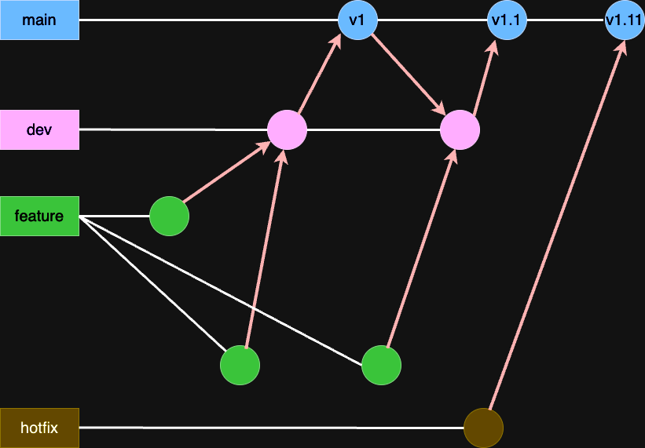

# Git workflow

You may not know about the words. If so, first of first you may have to read this page to know about it :)

[Getting Git right](https://www.atlassian.com/git)

## Prerequisites for managing git in frog-blossom-cms project

### main branch

Publishing and working the application in the production environment.

This branch will be merged from the `dev` branch.

It is supposed to hold the code that has been thoroughly tested and is ready for deployment to the production environment.

### dev branch

Working and testing in the development environment.

This branch will be merged from `feature` branches.

### feature branch

Developing new features and refactoring codes. Usually, the branch has its feature one on one.

### hotfix branch

Fixing critical bugs in the production environment. This branch is allowed to merge the main branch directly if it needed. However, it needs to pass the testing.

---

The idea is based on [github flow](https://docs.github.com/en/get-started/using-github/github-flow)

## Workflow

### Backend



1. Create a new feature branch from the `dev` branch on your PC.
2. Work for a specific purpose in the local branch.
3. Create a Pull request in Github.
4. Request review for your code in the Pull request. Adding members of devs in a sidebar on the page.
5. Get **Approve** to merge. When a reviewer gives you a **Request change**, you should fix what is pointed our by reviewers.
6. Merge pull request to the base branch which is basically the `dev` branch.
7. Do again from No.1 until the app will be able to published.

### Naming convention for branches

- Feature Branch: `feature/add-search-functionality`
- Hotfix Branch: `hotfix/urgent-security-patch`

### Better commit message for members

You must read at least once this reference, [Understanding Semantic Commit Messages Using Git and Angular](https://nitayneeman.com/posts/understanding-semantic-commit-messages-using-git-and-angular/).

But... what if you missed a file that is supposed to be staged or/and forgot to fix some lines?

You can fix the commit via this command,

```.shell
git commit --amend
```

> The git commit --amend command is a convenient way to modify the most recent commit. It lets you combine staged changes with the previous commit instead of creating an entirely new commit. It can also be used to simply edit the previous commit message without changing its snapshot.

References: [Rewriting history](https://www.atlassian.com/git/tutorials/rewriting-history#:~:text=The%20git%20commit%20%2D%2Damend,message%20without%20changing%20its%20snapshot.)

### Frontend

Stay tune ☺️

## Versioning

Start from 0 until we publish the first version. After then we'll plus 0.1. If we publish a bunch of breaking changes, plus 1.

When publishing hotfix version, plus 0.01.
